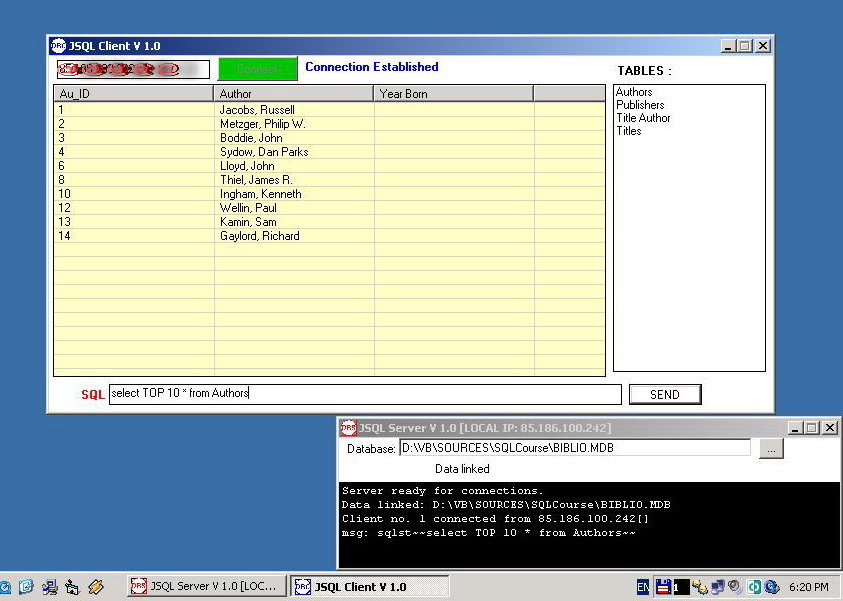



## ANY Database server/Client

### Description

This program is a general database server and client, working with ANY database opened from server. You can open any database on server, and the name of tables will be send to client. The client can send any SQL command to server (including create table, drop table too), and the server will be execute the command and send back result.

This program work with Data controll, listview controll (see screenshot). Support multiple client connections.
 
### More Info
 

             |
---                |---
**Submitted On**   |2006-03-11 09:38:30
**By**             |[JSystems](https://github.com/Planet-Source-Code/PSCIndex/blob/master/ByAuthor/jsystems.md)
**Level**          |Intermediate
**User Rating**    |5.0 (10 globes from 2 users)
**Compatibility**  |VB 4\.0 \(32\-bit\), VB 5\.0, VB 6\.0
**Category**       |[Complete Applications](https://github.com/Planet-Source-Code/PSCIndex/blob/master/ByCategory/complete-applications__1-27.md)
**World**          |[Visual Basic](https://github.com/Planet-Source-Code/PSCIndex/blob/master/ByWorld/visual-basic.md)
**Archive File**   |[ANY\_Databa1981033182006\.zip](https://github.com/Planet-Source-Code/jsystems-any-database-server-client__1-64697/archive/master.zip)

